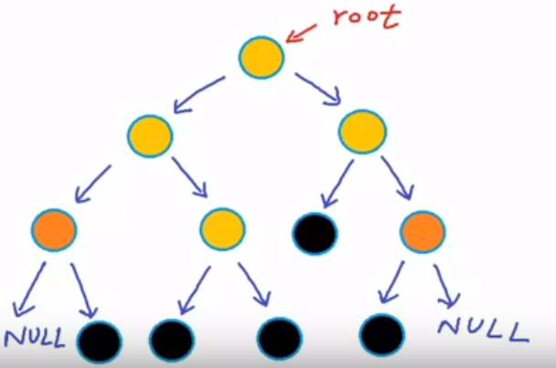

## Binary Tree

A binary tree is a tree data structure in which each node can have at most two children, which are referred to as the left child and the right child. 

### Example:

### Types of Binary Tree

### Properties of Binary Tree

### Tree Traversal